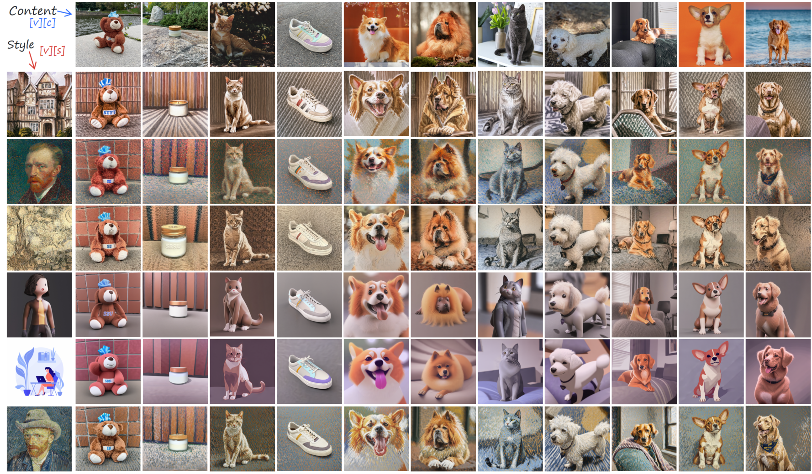

# K-LoRA

Official implementation of [K-LoRA: Unlocking Training-Free Fusion of Any Subject and Style LoRAs]().

## 🔥 Examples
Below are the results of **K-LoRA**. The rows correspond to the respective style references, the columns correspond to the respective object references, and each cell represents the output obtained using a specific randomly selected seed.




## 🚩TODO

- [x] super quick instruction for training each LoRAs
- [x] K-LoRA for SDXL (inference)
- [ ] K-LoRA for FLUX (inference)


## 🔧 Dependencies and Installation

## Installation
```
git clone https://github.com/ouyangziheng/K-LoRA.git
cd K-LoRA
pip install -r requirements.txt
```


### 1. Train LoRAs for subject/style images
In this step, 2 LoRAs for subject/style images are trained based on SDXL. Using SDXL here is important because they found that the pre-trained SDXL exhibits strong learning when fine-tuned on only one reference style image.

Fortunately, diffusers already implemented LoRA based on SDXL [here](https://github.com/huggingface/diffusers/blob/main/examples/dreambooth/README_sdxl.md) and you can simply follow the instruction. 

For example, your training script would be like this.
```bash
export MODEL_NAME="stabilityai/stable-diffusion-xl-base-1.0"

# for subject
export OUTPUT_DIR="lora-sdxl-dog"
export INSTANCE_DIR="dog"
export PROMPT="a sbu dog"
export VALID_PROMPT="a sbu dog in a bucket"

# for style
# export OUTPUT_DIR="lora-sdxl-waterpainting"
# export INSTANCE_DIR="waterpainting"
# export PROMPT="a cat of in szn style"
# export VALID_PROMPT="a man in szn style"

accelerate launch train_dreambooth_lora_sdxl.py \
  --pretrained_model_name_or_path=$MODEL_NAME  \
  --instance_data_dir=$INSTANCE_DIR \
  --output_dir=$OUTPUT_DIR \
  --instance_prompt="${PROMPT}" \
  --rank=8 \
  --resolution=1024 \
  --train_batch_size=1 \
  --learning_rate=5e-5 \
  --report_to="wandb" \
  --lr_scheduler="constant" \
  --lr_warmup_steps=0 \
  --max_train_steps=1000 \
  --validation_prompt="${VALID_PROMPT}" \
  --validation_epochs=50 \
  --seed="0" \
  --mixed_precision="no" \
  --enable_xformers_memory_efficient_attention \
  --gradient_checkpointing \
  --use_8bit_adam \
```

* You can find style images in [aim-uofa/StyleDrop-PyTorch](https://github.com/aim-uofa/StyleDrop-PyTorch/tree/main/data).
* You can find content images in [google/dreambooth/tree/main/dataset](https://github.com/google/dreambooth/tree/main/dataset).


### 2. Inference

You can directly use the script below for inference or interact by using the gradio.

```bash
export MODEL_NAME="stabilityai/stable-diffusion-xl-base-1.0"
export LORA_PATH_CONTENT="..."
export LORA_PATH_STYLE="..."
export OUTPUT_FOLDER="..."  
export PROMPT="..."

python inference.py \
  --pretrained_model_name_or_path="$MODEL_NAME" \
  --lora_name_or_path_content="$LORA_PATH_CONTENT" \
  --lora_name_or_path_style="$LORA_PATH_STYLE" \
  --output_folder="$OUTPUT_FOLDER" \
  --prompt="$PROMPT"

# using gradio 
# python inference_gradio.py \
#   --pretrained_model_name_or_path="$MODEL_NAME" \
#   --lora_name_or_path_content="$LORA_PATH_CONTENT" \
#   --lora_name_or_path_style="$LORA_PATH_STYLE" \
#   --output_folder="$OUTPUT_FOLDER" \
#   --prompt="$PROMPT"

```

## Citation
If you use this code or dataset, please cite the following paper:

## Contact
If you have any questions or suggestions, please feel free to open an issue or contact the authors at [ziheng.ouyang666@gmail.com](mailto:ziheng.ouyang666@gmail.com).